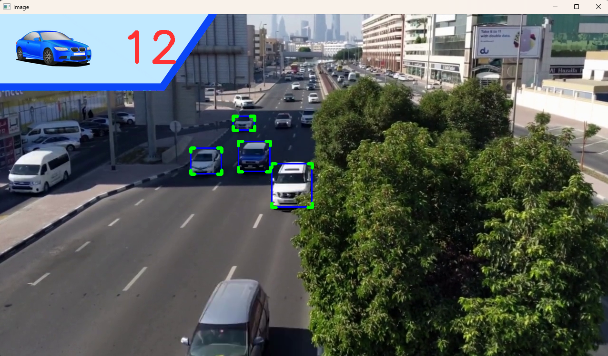
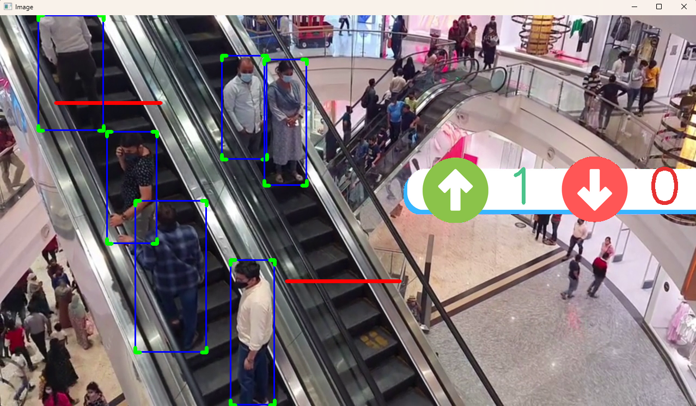
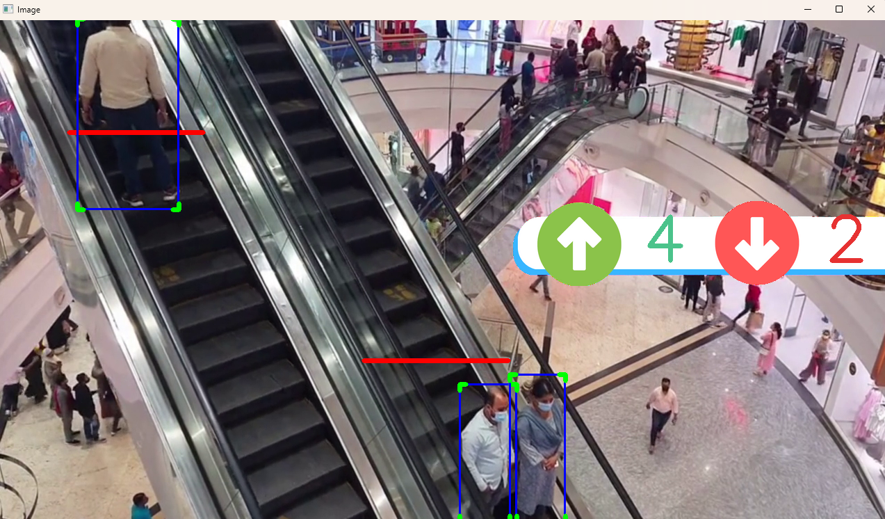
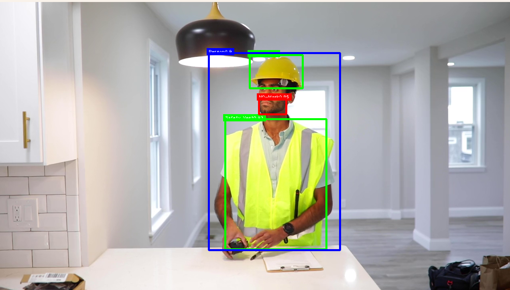

**1. Car Counter**
---

**2. People Counter**
---

**3. PPE Detection for Construction Safety**
---

---

Roboflow Links for the datasets used in the project:
---
- [View on Roboflow](https://universe.roboflow.com/roboflow-universe-projects/construction-site-safety/dataset/28)
- [View on Roboflow](https://universe.roboflow.com/augmented-startups/playing-cards-ow27d/dataset/3)

---
**Download the trained .pts, videos and masked design images from the following link:**
https://drive.google.com/drive/folders/1e99HpXWO_S9x5kW4mzwuncxUl3-wU9Cy?usp=sharing    